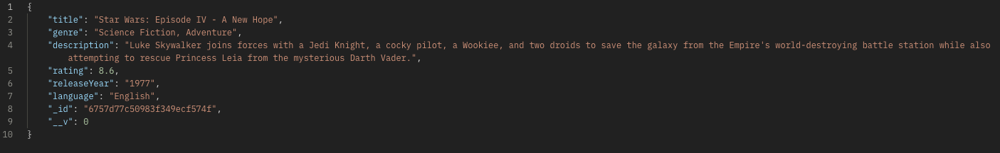
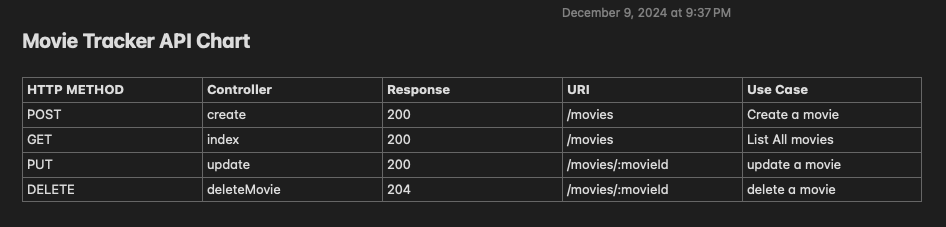

# CRUD-API-LAB (SERVER)

> this project contains 2 parts which is deployed in two separate repository
  ```
    • server (this repository)
    • front end vite application (front end app that uses this API)

  ```

## Movie Object




## Movie Tracker API Chart


